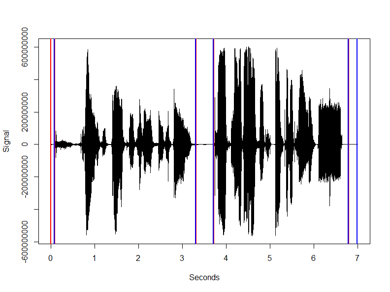

# audio.vadwebrtc

This repository contains an R package which is an Rcpp wrapper around the Voice Activity Detection module from the webrtc project.

- The package allows to detect the location of voice in audio

### Installation

- For the *development* version of this package: `remotes::install_github("bnosac/audio.vadwebrtc")`

Look to the documentation of the functions: `help(package = "audio.vadwebrtc")`

## Example

Get a audio file in 16 bit with mono PCM samples (pcm_s16le codec) with a sampling rate of either 8Khz, 16KHz or 32Khz 

```{r}
library(audio.vadwebrtc)
file <- system.file(package = "audio.vadwebrtc", "extdata", "test_wav.wav")
vad  <- VAD(file, mode = "normal")
vad$vad_segments
 vad_segment start  end has_voice
           1  0.00 0.08     FALSE
           2  0.09 3.30      TRUE
           3  3.31 3.71     FALSE
           4  3.72 6.78      TRUE
           5  6.79 6.99     FALSE
```

Example on a simple of these audio

```{r}
library(av)
x <- read_audio_bin(file)
plot(seq_along(x) / 16000, x, type = "l", xlab = "Seconds", ylab = "Signal")
abline(v = vad$vad_segments$start, col = "red", lwd = 2)
abline(v = vad$vad_segments$end, col = "blue", lwd = 2)
```




## Support in text mining

Need support in text mining?
Contact BNOSAC: http://www.bnosac.be


